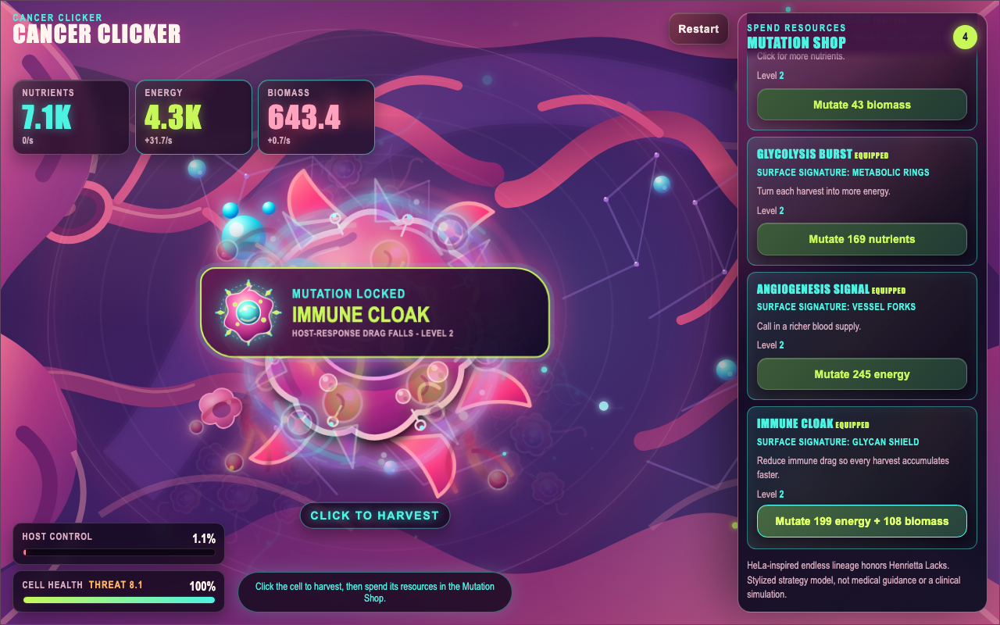

# Cancer Clicker

A browser-based visual incremental game for players who want a fast, no-backend clicker: harvest
tissue resources, evolve a fictional cell, and watch a messy colony spread through an organic
16:10 tissue chamber.

[Play Cancer Clicker on GitHub Pages](https://vosslab.github.io/cancer-clicker/)

## From one cell to a colony

The signature promise is simple: every click changes a living-looking cell, while every mutation
makes the next burst of growth feel more extravagant. Start with one transformed cell in a pulsing
tissue pocket, harvest nutrients, energy, and biomass, then spend those resources to create a
visibly stranger, faster-growing colony.

<!-- screenshots:begin (managed by screenshot-docs) -->

<!-- screenshots:end -->

This is a deliberately inverted, non-clinical strategy toy. It is not medical guidance, a disease
model, or a prediction of real cancer outcomes.

## The clicker loop

1. Awaken the founding cell and click it to harvest nutrients, energy, and biomass.
2. Watch the published `/s` rates continue accumulating between clicks.
3. Spend each resource in the permanently open Mutation Shop.
4. See new surface signatures appear on the cell, then use its faster growth to expand the colony.

The game has no failure screen, pause control, victory reset, or level cap. At 100% host control,
the host phase becomes an endless lineage phase: daughter-cell layers continue piling into a messy
tumor while the founding cell remains visible. The fictional HeLa-inspired lineage reference
respects Henrietta Lacks and does not use her story as a gameplay reward.

## Mutation shop

Each mutation compounds the clicker economy and visibly equips or intensifies a matching surface
signature. A successful purchase fires a named organic mutation burst and permanently marks the
shop card as equipped. Costs rise without a cap, which keeps the accumulation loop open ended.

| Mutation | Resource cost | Visible result |
| --- | --- | --- |
| Transporter swarm | Biomass | Receptor chevrons and stronger nutrient capture |
| Glycolysis burst | Nutrients | Metabolic rings and stronger energy harvests |
| Angiogenesis signal | Energy | Vessel forks and richer nutrient supply |
| Immune cloak | Energy + biomass | Glycan shield and lower host-response drag |

Every resource card shows its actual passive stock delta rather than a decorative estimate. Rates
and visible stocks stay non-negative; only an affordable mutation purchase spends resources.

## Start playing

The fastest path is the live game above. For a local production-shaped preview, install Node.js and
npm, then run:

```bash
./run_web_server.sh
```

The script builds the GitHub Pages artifact, serves `dist/` on a fresh local port, and prints the
address to open. Use the visible Awaken, Restart, cell, and Mutation Shop buttons; native controls
support keyboard focus.

To create the deployable artifact without serving it:

```bash
./build_github_pages.sh
```

[.github/workflows/deploy-pages.yml](.github/workflows/deploy-pages.yml) publishes `dist/` to the
confirmed GitHub Pages deployment.

## Organic visual system

The desktop application window and tissue playfield use a 16:10 aspect ratio. On narrow portrait
screens, the tissue chamber keeps that ratio while the always-open shop stacks below it, preserving
readable targets and copy instead of shrinking the game field. The artwork remains editable SVG:

- [src/art/tissue_scene.svg](src/art/tissue_scene.svg) supplies the layered tissue pocket.
- [src/art/tumor_cell.svg](src/art/tumor_cell.svg) supplies the founding cell and mutation layers.
- [src/art/daughter_colony.svg](src/art/daughter_colony.svg) supplies the expanding tumor mass.
- [src/art/immune_patrol.svg](src/art/immune_patrol.svg) supplies the host-response presence.
- [src/art/mutation_transporters.svg](src/art/mutation_transporters.svg),
  [src/art/mutation_glycolysis.svg](src/art/mutation_glycolysis.svg),
  [src/art/mutation_angiogenesis.svg](src/art/mutation_angiogenesis.svg), and
  [src/art/mutation_immune_cloak.svg](src/art/mutation_immune_cloak.svg) supply the mutation
  signatures.

## Verify a change

Run the fast TypeScript and Node gate:

```bash
./check_codebase.sh
```

Run the production-built browser walkthrough:

```bash
./run_playwright_tests.sh --build
```

Run the repository quality suite with its canonical environment setup:

```bash
source source_me.sh && pytest tests
```

[tests/test_simulation.mjs](tests/test_simulation.mjs) proves exact published-rate-to-stock-delta
behavior and distinct mutation ingredients. [tests/playwright/smoke.spec.ts](tests/playwright/smoke.spec.ts)
uses real visible clicks to buy all four mutations and verify their SVG layers activate.

## Documentation

- [docs/INSTALL.md](docs/INSTALL.md) explains local prerequisites and setup.
- [docs/USAGE.md](docs/USAGE.md) covers the play loop and local preview workflow.
- [docs/CODE_ARCHITECTURE.md](docs/CODE_ARCHITECTURE.md) maps the simulation, UI, and SVG layers.
- [docs/FILE_STRUCTURE.md](docs/FILE_STRUCTURE.md) describes the repository layout and generated files.
- [docs/RELATED_PROJECTS.md](docs/RELATED_PROJECTS.md) points to relevant incremental-game and
  browser-game references.
- [docs/CHANGELOG.md](docs/CHANGELOG.md) records current behavior and verification evidence.
- [docs/E2E_TESTS.md](docs/E2E_TESTS.md) and
  [docs/PLAYWRIGHT_USAGE.md](docs/PLAYWRIGHT_USAGE.md) explain the browser test boundary.

## Status and license

This is an actively evolving browser game. The economy and interface are intentionally lightweight:
there is no account, backend service, persistence layer, or clinical claim. Source code is available
under [LICENSE.MIT](LICENSE.MIT).
